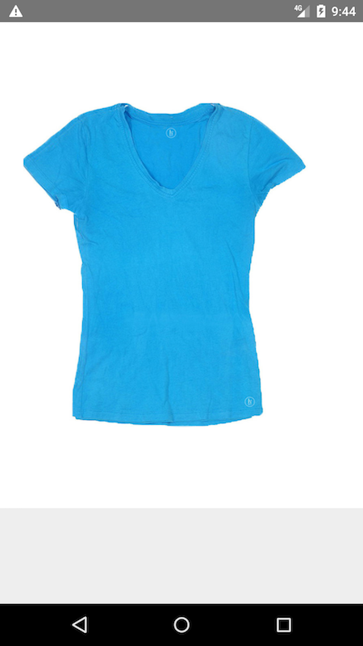

# ColorList
React Native project that fetching data from URL



# Installation

1. Clone project to your development workspace

    ```bash
    git clone git@github.com:hasborey/ColorList.git
    ```

2. Navigate to project folder

    ```bash
    cd ColorList
    ```
    
3. Run npm to install node package dependencies

    ```bash
    npm install
    ```

4. Eject running configuration

    ```bash
    react-native eject
    ```

5. Copy all asset to compile path

    ```bash
    react-native link
    ```

6. Run App for `Android` device

    Plug your device or open emulator

    ```bash
    react-native run-android
    ```

